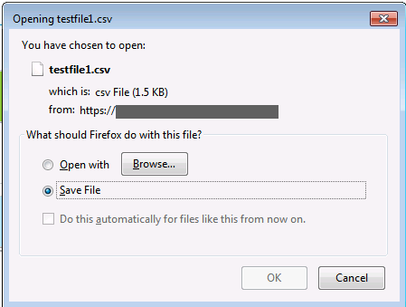

## User preference
To modify default settings/add personal settings in the FF browser, we can do it in its source file.  

For example, we want download files directly from websites without getting the popup to confirm the save/open option.

- Open the FF browser
- Type ```about:profiles``` as URL and hit __Enter__
- Select which profile we want to save our preferences into, and click __Open Folder__ under its _Root Directory_
- All default user settings are stored in file `prefs.js`; however to modify them, we need to create a new file to store the new settings
- Under the current folder, create a new file `user.js`
- Edit this file by pasting the following line from [user.js](user.js) 
- Save the file and close it
- Restart the browser
